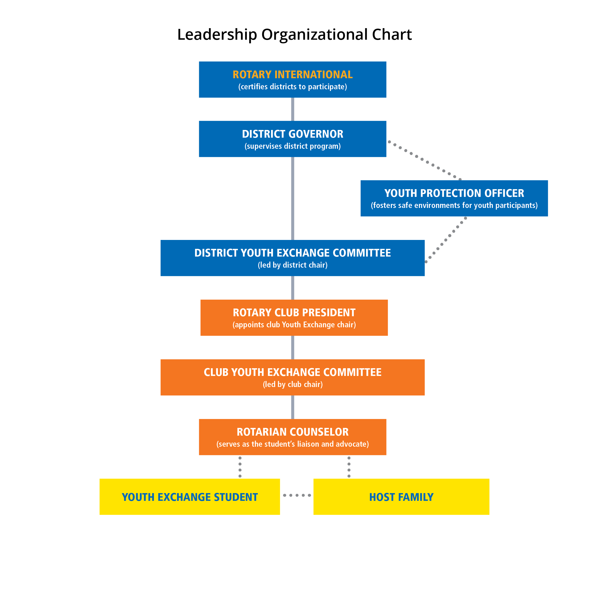

# 3. Building a Successful Youth Exchange Program

Youth Exchange programs are implemented by districts, with local Rotarians making all exchange arrangements. Clear leadership roles, organized committees, and well-trained and qualified leaders at the district and club levels will ensure your program’s success for years to come.

## Leadership Roles and Responsibilities

An effective Youth Exchange program relies on dedicated Rotarians serving in leadership positions. Although positions can vary by district and club, all leaders should clearly understand the division of responsibilities, at both levels, for sending and hosting students. You can help simplify communication and administrative tasks by mirroring the district’s committee roles in your club’s committee structure. Here are some common responsibilities that will help your team succeed:

## District

Through the district certification process with Rotary International, districts create and implement the administrative policies and procedures that enable their clubs to participate in the Youth Exchange program.









## Multidistrict Youth Exchange Groups

Multidistrict Youth Exchange groups are administrative bodies made up of several districts, established to support exchange activities. Many districts have found it streamlines administrative duties and can ease the burden placed on participating districts. Although each multidistrict group operates differently, many arrange training and orientation for students, process applications and visa paperwork, negotiate group rates for travel and insurance, and promote the program in a specific geographic area.  
If your district is interested in joining an existing group or starting a new one, email [youthexchange@rotary.org](mailto:youthexchange@rotary.org) for more information.

## 

